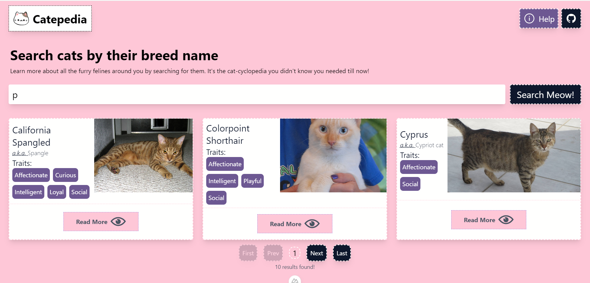

<p align="center">
  
</p>

# Catepedia

Catepedia is a cat breed search app built with Nuxt 3. It allows you to browse through different cat breeds and learn more about their characteristics, temperament, and history. You can also search for a specific cat breed by name or filter them by origin, coat, and pattern.

<p align="center">
  
</p>

## Features

- File-based routing: Catepedia uses the structure of the pages directory to define the routes of the app.
- Data fetching: Catepedia uses composables to fetch data from [The Cat API](https://thecatapi.com/) and render them in different ways, such as server-side rendering (SSR), static site generation (SSG), or serverless functions.
- Vite: Catepedia benefits from the fast development and bundling of Vite, which supports hot module replacement (HMR) and code splitting.
- TypeScript: Catepedia is written in type-safe code with the help of Nuxt's auto-generated types and tsconfig.json.

## Installation

To run Catepedia locally, you need to have Node.js and npm installed on your machine. You also need to get an API key from [The Cat API](https://thecatapi.com/) and add it to a `.env` file in the root directory of the project.

```bash
# Clone the repository
git clone https://github.com/Rajesh-Royal/catepedia.git

# Change the working directory
cd catepedia

# Install dependencies
npm install

# Run the app in development mode
npm run dev
```

## Contributing

Catepedia is an open source project and contributions are welcome. If you want to contribute, please follow these steps:

- Fork the repository and create a new branch for your feature or bug fix.
- Write clear and descriptive commit messages and follow the [conventional commits](https://gist.github.com/qoomon/5dfcdf8eec66a051ecd85625518cfd13) format.
- Make sure your code follows the ESLint and Prettier rules.
- Write tests for your code using [Jest] and [Vue Test Utils].
- Open a pull request and describe your changes.

## License

Catepedia is licensed under the [MIT License](/LICENSE).

## Other Information
Look at the [Nuxt 3 documentation](https://nuxt.com/docs/getting-started/introduction) to learn more.

## Setup

Make sure to install the dependencies:

```bash
# npm
npm install

# pnpm
pnpm install

# yarn
yarn install

# bun
bun install
```

## Development Server

Start the development server on `http://localhost:3000`:

```bash
# npm
npm run dev

# pnpm
pnpm run dev

# yarn
yarn dev

# bun
bun run dev
```

## Production

Build the application for production:

```bash
# npm
npm run build

# pnpm
pnpm run build

# yarn
yarn build

# bun
bun run build
```

Locally preview production build:

```bash
# npm
npm run preview

# pnpm
pnpm run preview

# yarn
yarn preview

# bun
bun run preview
```

Check out the [deployment documentation](https://nuxt.com/docs/getting-started/deployment) for more information.

---
